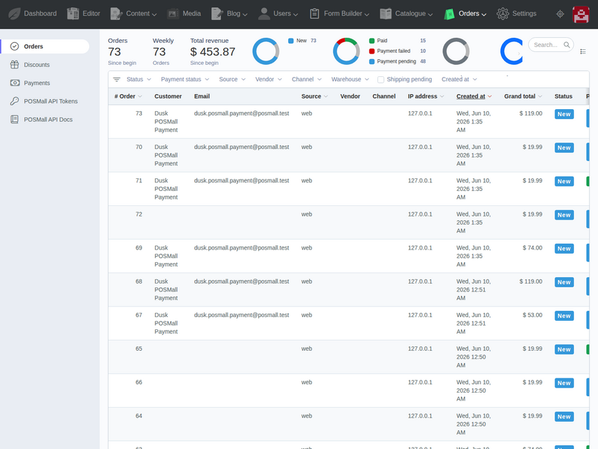
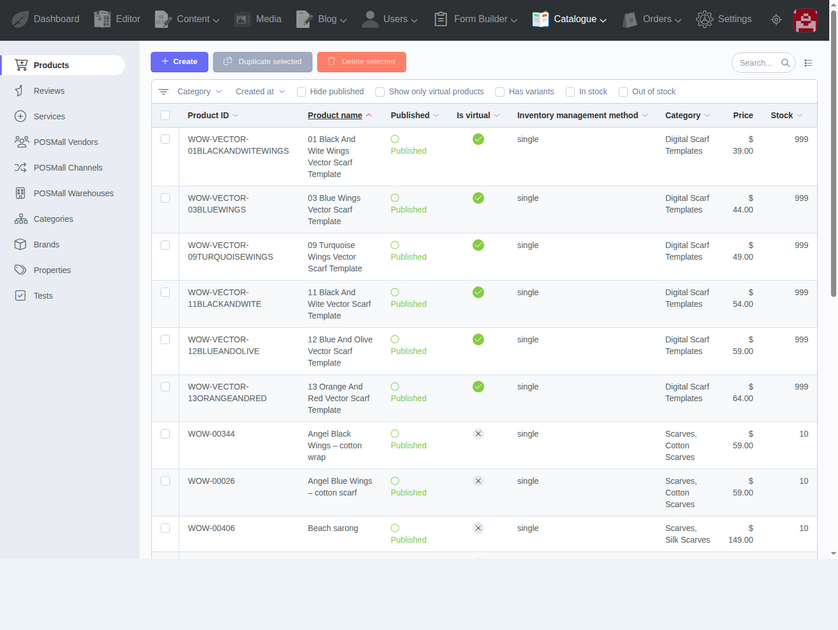
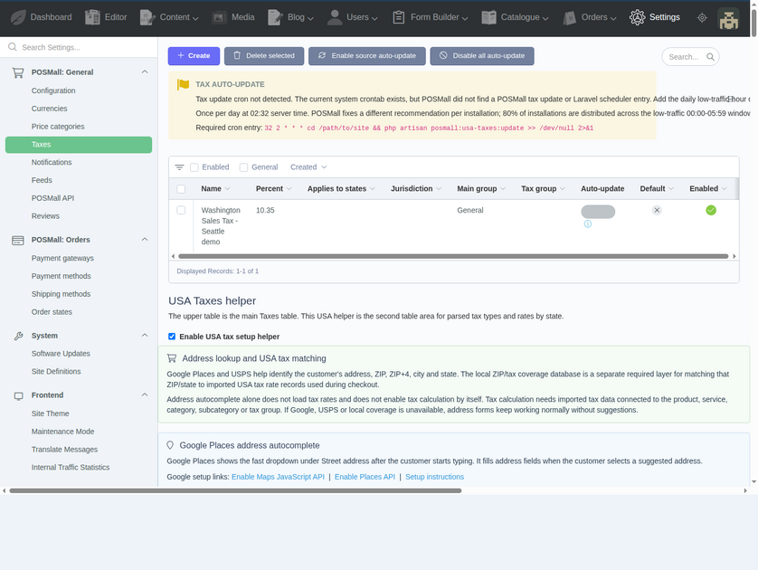
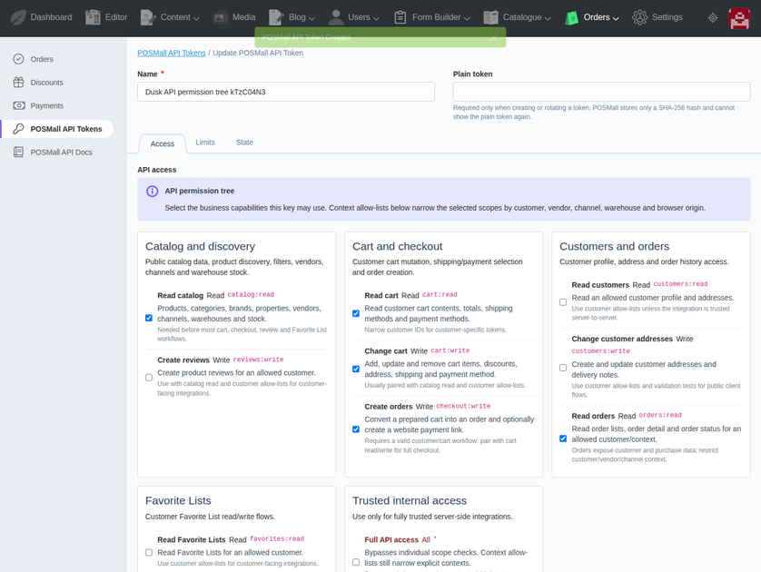
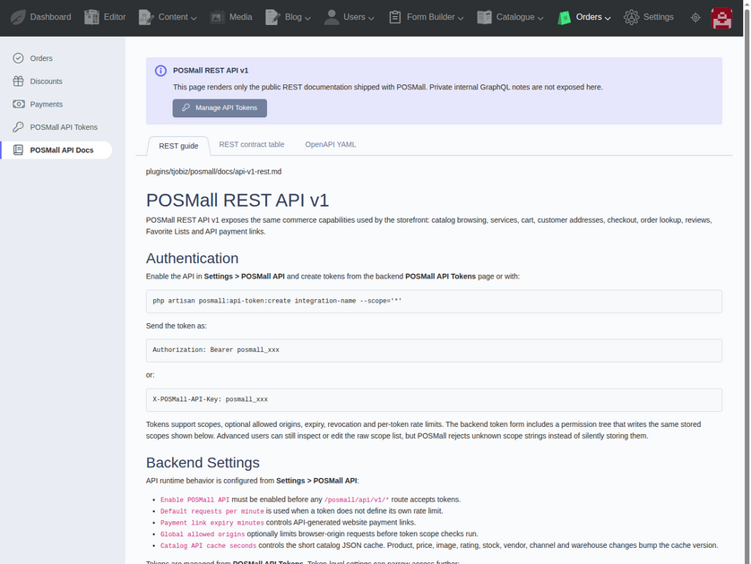

# POSMall - PostgreSQL-First eCommerce Plugin for October CMS and Laravel


POSMall is a PostgreSQL-first eCommerce plugin for October CMS and Laravel by KodZero. It provides the commerce backend for online stores, product catalogs, point-of-sale workflows, service catalogs, item customization, virtual products, customer accounts, checkout, orders, payments, shipping, taxes, discounts, reviews and API-ready business automation.

The plugin owns the shop logic. The companion storefront theme owns the visual customer experience.

- October CMS Marketplace plugin page: <https://octobercms.com/plugin/kodzero-posmall>
- October CMS Marketplace theme page: <https://octobercms.com/theme/kodzero-posmalltheme>
- POSMall plugin repository: <https://github.com/TjoBiZ/POSMall>
- POSMall theme repository: <https://github.com/TjoBiZ/POSMallTheme>

Use `kodzero/posmall-plugin` when you need the October CMS / Laravel eCommerce engine. Use `kodzero/posmalltheme-theme` when you need a ready storefront theme that is wired to the POSMall catalog, cart, checkout, services, virtual products and customer-account flows.

Together, the plugin and theme provide a complete PostgreSQL-backed eCommerce solution for small and growing businesses.

## Screenshots

| Orders | Products |
| --- | --- |
|  |  |

| Taxes and settings | API permissions |
| --- | --- |
|  |  |



## Core Capabilities

- Product catalog, categories, brands, prices, variants, images, and stock.
- Native product properties for filters, variant selection, item customization and catalog services.
- PostgreSQL product index for catalog filtering and sorting.
- Cart, checkout, orders, order products, totals, taxes, shipping, and discounts.
- Payment provider flow with built-in and extendable payment classes.
- Virtual products and downloadable products.
- Product services and service options.
- Wishlists, reviews, customer profiles, addresses, and account flows.
- Search, SEO fields, JSON-LD output, and feed/integration points.
- Point of sale and online store workflows for small, medium and large business.
- API-ready architecture for controlled external commerce integrations and business automation.
- Local/dev seed commands for realistic demo catalogs and property sets.

## Companion Theme

The recommended frontend for this plugin is the POSMall theme:

```text
https://github.com/TjoBiZ/POSMallTheme
```

The theme is designed for the plugin's October components and routes. It includes storefront pages
for catalog browsing, product details, search, services, cart, checkout, payment links, customer
accounts, privacy/terms pages, optimized images and PageSpeed-ready CSS/JS assets.

Install the plugin first, then install the companion POSMall theme when you need the ready
storefront. The full Composer command sequence is listed in the Installation section below.

Activate `POSMall Theme` in the October CMS backend after installing the package.

## PostgreSQL-First Release

This package is documented and tested as a PostgreSQL package. The active index binding uses PostgreSQL for the database-backed product index.

The current release was built and tested in this project on PostgreSQL 18 and PHP 8.2.

## Installation

Install the public Marketplace packages through Composer:

```bash
cd /path/to/octobercms

composer require kodzero/posmall-plugin kodzero/posmalltheme-theme -W

php artisan october:migrate
php artisan cache:clear
php artisan config:clear
php artisan route:clear
php artisan view:clear
```

This runs the POSMall migrations and creates the baseline commerce settings required for a clean
installation, including the default currency and the default payment, shipping, tax, notification
and order-state rows. POSMall uses USD as the default currency after installation.

Marketplace pages:

- Plugin: <https://octobercms.com/plugin/kodzero-posmall>
- Theme: <https://octobercms.com/theme/kodzero-posmalltheme>

After installation:

1. Activate `POSMall Theme` in the October CMS backend when using the companion storefront.
2. Open POSMall settings and review currencies, payment methods, shipping methods and tax rules.
3. Add or import categories, brands, products, services, virtual products and prices.
4. Rebuild the catalog index after importing or changing large product sets:

```bash
php artisan posmall:index --force
```

### Quick Demo Catalog / Test Products

For a fast demo storefront after installation, populate the store with the curated WingsOfWin
test catalog. This command creates a realistic small shop with roughly forty product examples,
service examples, virtual-product examples, prices, properties, images and related catalog data.

Run this only on a new demo, staging or evaluation store. The `--force` flag is intentionally
destructive for catalog data: it replaces the local POSMall catalog with the bundled demo dataset.
Do not run it on a production store that already contains real products.

```bash
php artisan posmall:seed-wings-of-win --force
php artisan posmall:index --force
php artisan posmall:images:optimize-catalog --profile=all
php artisan cache:clear
php artisan view:clear
```

After the command finishes, open the POSMall storefront catalog and backend product/service
sections to review the generated demo products, services and virtual-product examples.

### Recovery After Interrupted Composer Install

If a previous install was interrupted, or Git reports `detected dubious ownership`, reset the
POSMall package paths and run the Composer source install again:

```bash
cd /path/to/octobercms

APP_USER="$(id -un)"
WEB_GROUP="www-data"

jobs -p | xargs -r kill -9 2>/dev/null || true

sudo rm -rf plugins/kodzero/posmall themes/kodzero-posmalltheme themes/kodzero-posmall themes/posmall themes/POSMall
sudo rm -rf vendor/kodzero/posmall-plugin vendor/kodzero/posmalltheme-theme
sudo find vendor/composer -maxdepth 1 -type d \( -name 'tmp-*' -o -name '*TjoBiZ-POSMall*' -o -name '*TjoBiZ-POSMallTheme*' \) -exec rm -rf {} + 2>/dev/null || true

sudo mkdir -p plugins/kodzero themes vendor/kodzero
sudo chown -R "$APP_USER:$WEB_GROUP" plugins/kodzero themes vendor/kodzero vendor/composer composer.json composer.lock
sudo chmod -R ug+rwX plugins/kodzero themes vendor/kodzero vendor/composer

git config --global --add safe.directory "$(pwd)/plugins/kodzero/posmall"
git config --global --add safe.directory "$(pwd)/themes/kodzero-posmalltheme"

composer config --unset repositories.posmall || true
composer config --unset repositories.posmall-theme || true
composer config --unset repositories.posmall-local || true
composer config --unset repositories.posmall-theme-local || true

composer clear-cache
composer require kodzero/posmall-plugin kodzero/posmalltheme-theme -W

composer dump-autoload
php artisan october:migrate
php artisan cache:clear
php artisan config:clear
php artisan route:clear
php artisan view:clear
```

### Development Source Install

Use the direct GitHub source install only for local development, release verification, or when you
need to test an unreleased `main` branch commit before the October Marketplace package has been
rebuilt.

```bash
cd /path/to/octobercms

composer config repositories.posmall '{"type":"vcs","url":"https://github.com/TjoBiZ/POSMall.git","no-api":true}'
composer config repositories.posmall-theme '{"type":"vcs","url":"https://github.com/TjoBiZ/POSMallTheme.git","no-api":true}'

composer require kodzero/posmall-plugin:dev-main kodzero/posmalltheme-theme:dev-main -W --prefer-source --no-interaction

php artisan october:migrate
php artisan cache:clear
php artisan config:clear
php artisan route:clear
php artisan view:clear
```

### Direct Git Fallback

Use this only when Composer source install is unavailable on a specific server. Composer source
install above remains the normal path.

```bash
cd /path/to/octobercms

APP_USER="$(id -un)"
WEB_GROUP="www-data"

sudo rm -rf plugins/kodzero/posmall themes/kodzero-posmalltheme themes/kodzero-posmall themes/posmall themes/POSMall
sudo mkdir -p plugins/kodzero themes

git clone --depth 1 https://github.com/TjoBiZ/POSMall.git plugins/kodzero/posmall
git clone --depth 1 https://github.com/TjoBiZ/POSMallTheme.git themes/kodzero-posmalltheme

sudo chown -R "$APP_USER:$WEB_GROUP" plugins/kodzero/posmall themes/kodzero-posmalltheme
sudo chmod -R ug+rwX plugins/kodzero/posmall themes/kodzero-posmalltheme

composer dump-autoload
php artisan october:migrate
php artisan cache:clear
php artisan config:clear
php artisan route:clear
php artisan view:clear
```

## Storefront Image Cache

POSMall keeps original product photos unchanged, including uploaded JPG, PNG, WebP and iPhone
HEIC/HEIF files. Storefront-optimized JPEG and WebP derivatives are generated into a separate
cache tree:

```text
storage/app/media/posmall/cache/images/{catalog,product,service}/{webp,jpeg}
```

The cache keeps the source folder structure and keeps the source SEO filename at the beginning of
each generated filename. Profile, size and sequence data are appended at the end for traceability.

SVG files are served directly because they are already vector assets. HEIC/HEIF originals are
preserved but are not used as storefront `` sources; they are converted to generated JPEG/WebP
derivatives when ImageMagick supports the format.

Regenerate the image cache after clearing generated media or before image-enabled catalog
benchmarks:

```bash
php artisan posmall:images:optimize-catalog --profile=all
```

In the backend, use POSMall Tests -> Catalog load -> Rebuild optimized image cache.

## Storefront PageSpeed Asset Cache

The companion POSMall storefront theme can generate Laravel Mix minified CSS/JS derivatives for catalog,
product, service, cart and checkout pages. The originals stay readable under
`themes/kodzero-posmalltheme/assets/posmall/css` and `themes/kodzero-posmalltheme/assets/posmall/js`. Mix entry files live
under `themes/kodzero-posmalltheme/assets/src`; import additional storefront code there before optimized builds.
Generated files live under:

```text
themes/kodzero-posmalltheme/assets/posmall/compiled/{css,js}
```

The layout uses compiled files only when "Use optimized storefront assets" is enabled in POSMall
general settings and the compiled files exist. Otherwise it falls back to readable source files.
Minification and PurgeCSS can break dynamic CSS classes or JS selectors when entry files/safelist
are incomplete, so test the catalog, product, cart and checkout pages after enabling it.

Install and build from the POSMall theme asset directory for true Laravel Mix output:

```bash
cd themes/kodzero-posmalltheme/assets
npm install
npm run prod
```

The backend button and artisan command prefer Laravel Mix when dependencies are installed. If they
are not installed, they use a conservative PHP fallback minifier and write that builder into the
manifest. Rebuild assets after editing storefront CSS/JS or before PageSpeed/catalog benchmarks:

```bash
php artisan posmall:pagespeed:optimize-assets
```

Use `--mix-only` in CI or release checks when fallback output is not acceptable:

```bash
php artisan posmall:pagespeed:optimize-assets --mix-only
```

In the backend, use POSMall Tests -> Catalog load -> Rebuild PageSpeed assets.

## Important Runtime Dependencies

- October CMS 4
- Laravel 12
- PHP 8.2+
- PHP Imagick extension (`ext-imagick`) and ImageMagick CLI with JPEG, PNG, WebP and HEIC/HEIF support for storefront image derivative generation
- PostgreSQL 18 tested
- RainLab.User
- RainLab.Location
- RainLab.Translate

Install the required runtime packages from the OctoberCMS project root:

```bash
composer require \
  rainlab/user-plugin:^3.0 \
  rainlab/location-plugin:^2.0 \
  rainlab/translate-plugin:^2.0 \
  barryvdh/laravel-dompdf:^3.0 \
  hashids/hashids:^5.0 \
  league/omnipay:^3.2 \
  omnipay/paypal:^3.0 \
  omnipay/stripe:^3.0 \
  whitecube/php-prices:^3.0
```

Install `ext-imagick` and ImageMagick through the operating system / PHP image used by the project
before running image optimization. Composer validates `ext-imagick` as a platform requirement; it
does not download the native extension itself.

Optional integrations:

```bash
composer require vitalybaev/google-merchant-feed:^2.6
composer require stripe/stripe-php
composer require bummzack/omnipay-postfinance
composer require elasticsearch/elasticsearch
composer require offline/jsonq tmarois/filebase
```

Development and backend test dependencies:

```bash
composer require --dev fakerphp/faker:^1.23 mockery/mockery:^1.6
```

The plugin's OctoberCMS code is `KodZero.POSMall`. Install/refresh commands should use that namespace:

```bash
php artisan october:migrate
php artisan plugin:refresh KodZero.POSMall --force
php artisan posmall:index --force
```

## Main Code Areas

```text
components/       Storefront components: catalog, filters, product, cart, checkout, search, services
controllers/      October backend controllers
models/           Shop domain models
classes/index/    Product index implementations
classes/payments/ Payment provider and redirect logic
classes/totals/   Cart and order total calculation
classes/traits/   Shared domain behavior
console/          Seed, index, check, and test commands
updates/          Migrations and seeders
```

## Public Documentation

Start with this README for the public package. Detailed local architecture notes, internal review
logs and project-specific business maps are intentionally not bundled into the public plugin
repository because they may contain local development context.

Public-safe plugin docs are bundled under:

```text
docs/
```

Included public docs:

- `docs/api-v1-rest.md` - REST API v1 guide.
- `docs/api-v1-contract.md` - REST API contract table and route access model.
- `docs/openapi-v1.yaml` - OpenAPI skeleton.
- `docs/usa-tax-auto-update.md` - USA tax auto-update behavior and cron notes.
- `docs/extension-hooks.md` - public programming extension hooks for companion plugins, internal
  modules and custom POSMall solutions.

Private GraphQL operating notes, local AI-development reports, raw benchmark work files and
internal architecture maps are intentionally not published in this repository.

## Licensing

POSMall is publicly visible, but original POSMall additions are not released for
standalone resale, redistribution or repackaging.

The root `LICENSE` file is the license map for this repository.

This repository is published from a fork of OFFLINE.Mall by OFFLINE GmbH.
Fork-origin portions keep their upstream notice in
`THIRD-PARTY-NOTICES/OFFLINE-MALL-LICENSE.md`.

Original POSMall additions by KodZero / POSMall contributors are covered by the POSMall Non-Resale
License in `LICENSE-POSMALL.md`. These additions may be used and modified for personal projects,
internal projects, client implementation/support work and operating a website or application, but
may not be resold, sublicensed, redistributed, published, extracted or packaged as a standalone
product, marketplace item, plugin, theme, starter kit, source package or competing package.

Read `LICENSING.md` for the full license map.

WingsOfWin demo catalog files under `updates/seeders/demo/` are governed by
`LICENSE-WINGSOFWIN-DEMO-CONTENT.md`. They are included for evaluation, learning, local
development and demo seeding; they are not commercial inventory and may not be resold or
redistributed as an asset/demo package.

## Notes

This plugin is still evolving. Public documentation intentionally explains the system at a product and integration level.
